<picture>
  <source media="(prefers-color-scheme: dark)" srcset="assets/generated/hero-dark.svg">
  <source media="(prefers-color-scheme: light)" srcset="assets/generated/hero-light.svg">
  
</picture>

Signal & topology

<picture>
  <source media="(prefers-color-scheme: dark)" srcset="assets/generated/activity-dark.svg">
  <source media="(prefers-color-scheme: light)" srcset="assets/generated/activity-light.svg">
  
</picture>

<picture>
  <source media="(prefers-color-scheme: dark)" srcset="assets/generated/topology-dark.svg">
  <source media="(prefers-color-scheme: light)" srcset="assets/generated/topology-light.svg">
  
</picture>

[Repositories](https://github.com/HarzerHeribert?tab=repositories) · [Source & build](docs/architecture.md) · [Public-only data policy](docs/security.md)
